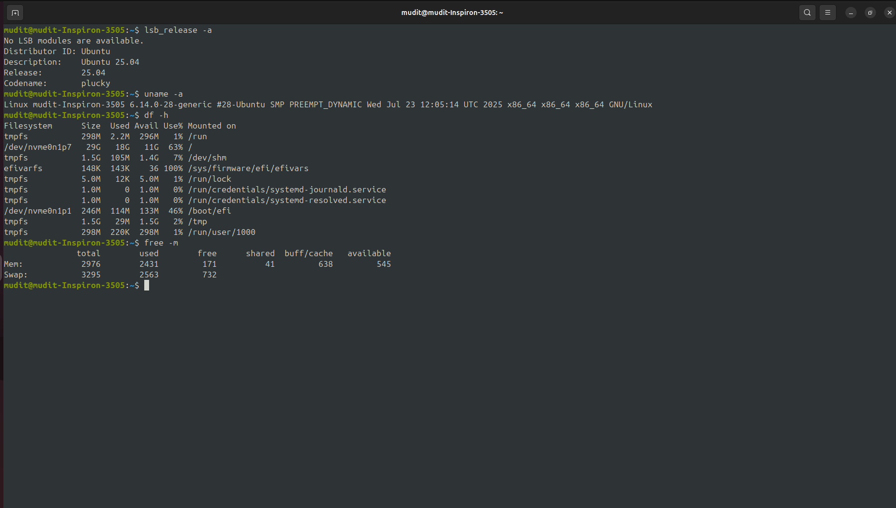

---

# 🐧 Ubuntu Installation Guide – Choose Your Path

> 🚀 Whether you're new to Linux or diving deeper, follow this guide to get Ubuntu up and running — either on a virtual machine or your actual system via dual boot.

---

## 🔧 Installation Options

### 🅰️ Option A – Virtual Machine (Beginner-Friendly)

> Set up Ubuntu safely inside your existing OS using a VM.

#### ✅ Steps:

1. **Install VirtualBox**
   [Download VirtualBox](https://www.virtualbox.org/wiki/Downloads)

2. **Download Ubuntu ISO**
   [Ubuntu LTS ISO (latest)](https://ubuntu.com/download/desktop)

3. **Create a New VM**:

   * RAM: **2 GB** minimum
   * Disk: **20 GB** (dynamically allocated is fine)
   * OS Type: **Linux > Ubuntu (64-bit)**

4. **Attach ISO and Start Installation**
   Use the ISO as a virtual CD to install Ubuntu inside the VM.

---

### 🅱️ Option B – Dual Boot (Advanced)

> Install Ubuntu alongside your existing operating system for full performance.

#### ⚠️ Prerequisites:

* Backup your data
* Minimum **30 GB** of unallocated space
* Bootable USB creation tool like **Rufus** or **Balena Etcher**

#### ✅ Steps:

1. **Partition your disk** (30 GB minimum) from within your existing OS.
2. **Create a bootable USB** with Ubuntu ISO.
3. **Boot from USB** and choose “Install Ubuntu alongside \[Your OS]”.
4. **Install Ubuntu**, carefully assigning the correct partition.
5. **GRUB Bootloader** will be set up to let you choose OS on boot.

---

## 📟 After Installation – Run These Commands

Once you're inside Ubuntu, open a terminal (`Ctrl + Alt + T`) and run:

```bash
lsb_release -a
```

> Shows Ubuntu version installed

```bash
uname -a
```

> Shows kernel version and architecture

```bash
df -h
```

> Displays disk usage in human-readable format

```bash
free -m
```

> Shows memory usage in MB

---

## 🧪 Sample Output

### 🔹 `lsb_release -a`

```
Distributor ID: Ubuntu
Description:    Ubuntu 22.04.3 LTS
Release:        22.04
Codename:       jammy
```

### 🔹 `uname -a`

```
Linux ubuntu-vm 5.15.0-91-generic #101-Ubuntu SMP x86_64 GNU/Linux
```

### 🔹 `df -h`

```
Filesystem      Size  Used Avail Use% Mounted on
/dev/sda1        20G   5.4G   13G  30% /
```

### 🔹 `free -m`

```
              total        used        free      shared  buff/cache   available
Mem:           2048         510         950          20         588        1400
```

---

## 🧠 Why This Matters

| Command       | Purpose                        |
| ------------- | ------------------------------ |
| `lsb_release` | Ubuntu version info            |
| `uname`       | Kernel and system architecture |
| `df -h`       | How your disk is used          |
| `free -m`     | Available and used memory      |

---

## 🎉 You're Ready!

Whether you chose the safe **Virtual Machine** path or the power-user **Dual Boot** route, you now have a Linux system ready to explore, develop, and automate.


