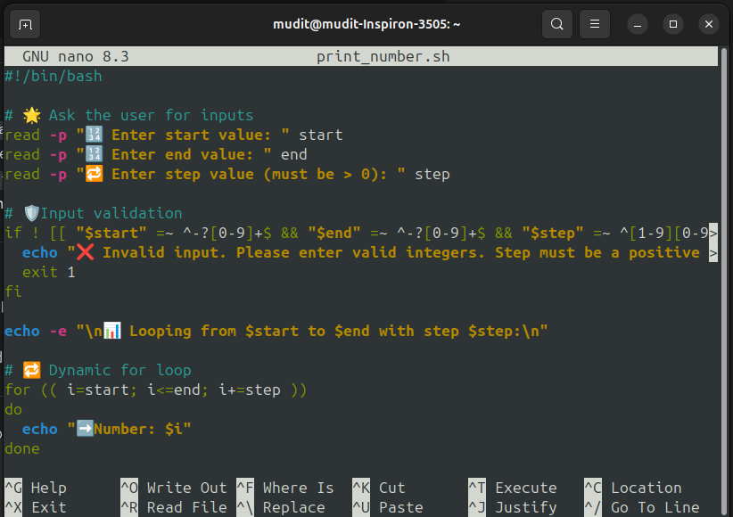
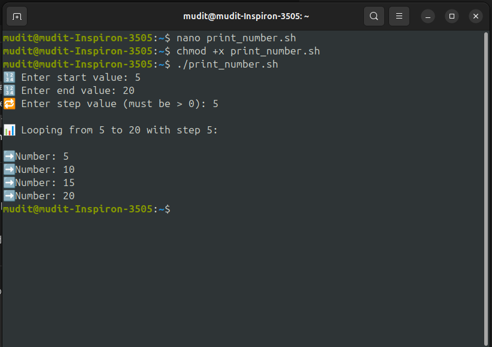

---

# 🎯 Bash Lab – Dynamic For Loop with Validated User Input

> ✨ Build interactive Bash scripts that respond to user input, validate it, and loop like a pro!

---

## 🔖 Tech Badges


---

## 📜 Script Overview

This Bash script allows a user to:

✅ Define a **start**, **end**, and **step** value
✅ Validates the inputs
✅ Executes a `for` loop based on those values
✅ Outputs a neat list of numbers from start ➡️ end using the given step

---

## 🛠️ Script Code: `custom_loop.sh`

```bash
#!/bin/bash

# --- Title ---
echo "🔁 Dynamic For Loop with User Input"

# --- User Inputs ---
read -p "🔢 Enter start value: " start
read -p "🔢 Enter end value: " end
read -p "🔁 Enter step value (must be > 0): " step

# --- Input Validation ---
if ! [[ "$start" =~ ^-?[0-9]+$ && "$end" =~ ^-?[0-9]+$ && "$step" =~ ^[1-9][0-9]*$ ]]; then
  echo "❌ Error: All inputs must be integers, and step must be a positive number."
  exit 1
fi

# --- For Loop Execution ---
echo -e "\n🚀 Looping from $start to $end with step $step:\n"

for (( i=start; i<=end; i+=step ))
do
  echo "➡️ Number: $i"
done
```


---

## 🧪 Sample Output

```bash
🔢 Enter start value: 2
🔢 Enter end value: 10
🔁 Enter step value (must be > 0): 2

🚀 Looping from 2 to 10 with step 2:

➡️ Number: 2
➡️ Number: 4
➡️ Number: 6
➡️ Number: 8
➡️ Number: 10
```

---

## 🧠 Key Concepts

| Feature        | Description                                       |
| -------------- | ------------------------------------------------- |
| `read`         | Takes input from user via terminal                |
| Regex Matching | Ensures inputs are **valid integers**             |
| `for (( ))`    | C-style loop to control iteration                 |
| `echo -e`      | Enables special characters like `\n` for newlines |

---

## 📝 How to Run the Script

1. Open terminal.
2. Create the file:

   ```bash
   nano custom_loop.sh
   ```
3. Paste the code and save (`Ctrl + O`, `Enter`, then `Ctrl + X`).
4. Make it executable:

   ```bash
   chmod +x custom_loop.sh
   ```
5. Run it:

   ```bash
   ./custom_loop.sh
   ```

---

## 💡 Challenge Yourself!

* 🔁 Modify it to loop **backwards** if `start > end`.
* 🧮 Allow **floating-point** numbers using `bc` or `awk`.
* 🎨 Add color using ANSI codes for vibrant output.

---

## 🎉 Final Thoughts

This script is a great start toward building more **interactive** and **intelligent** Bash automation tools. With just a few tweaks, you can transform basic CLI interactions into professional-grade utilities!


