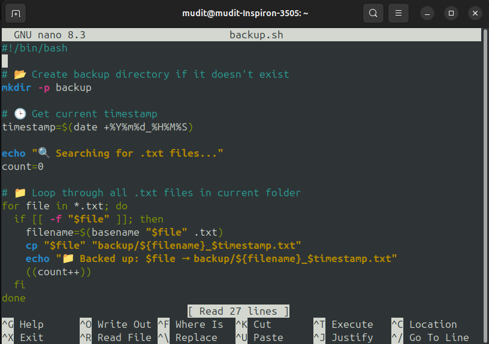
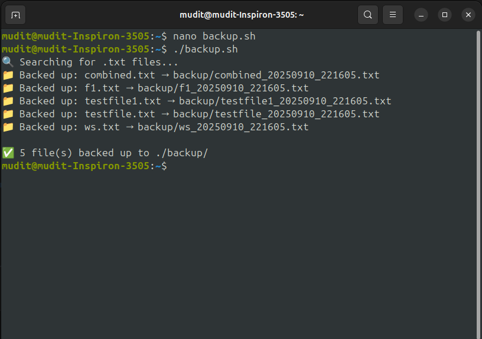

---

# 🗂️ Bash Automation Lab – Text File Backup with Timestamps

> 🎯 This script automates the process of backing up `.txt` files from the current directory into a `backup/` folder, appending a **timestamp** to each filename for safe versioning.

---

## 🔖 Tech Badges


---

## 📜 Script Overview – `backup.sh`

```bash
#!/bin/bash

# 📂 Create backup directory if it doesn't exist
mkdir -p backup

# 🕒 Get current timestamp
timestamp=$(date +%Y%m%d_%H%M%S)

echo "🔍 Searching for .txt files..."
count=0

# 📁 Loop through all .txt files in current folder
for file in *.txt; do
  if [[ -f "$file" ]]; then
    filename=$(basename "$file" .txt)
    cp "$file" "backup/${filename}_$timestamp.txt"
    echo "📁 Backed up: $file → backup/${filename}_$timestamp.txt"
    ((count++))
  fi
done

# ✅ Result
if [[ $count -gt 0 ]]; then
  echo -e "\n✅ $count file(s) backed up to ./backup/"
else
  echo "⚠️ No .txt files found to back up."
fi
```


---

## 🧠 What the Script Does

| Step                                    | Description                                            |
| --------------------------------------- | ------------------------------------------------------ |
| `mkdir -p backup`                       | Creates a folder named `backup/` (if it doesn't exist) |
| `date +%Y%m%d_%H%M%S`                   | Captures the current date and time as a timestamp      |
| `for file in *.txt`                     | Iterates through all `.txt` files in the directory     |
| `cp file backup/filename_timestamp.txt` | Copies each file with a new name into `backup/`        |
| Final Output                            | Displays success or warning messages                   |

---

## 🧪 Example Run

### 🗂️ Before:

```
notes.txt
todo.txt
```

### ▶️ Run Script:

```bash
./backup.sh
```

### 📁 After:

```
backup/
├── notes_20250910_190201.txt
└── todo_20250910_190201.txt
```

---

## ⚙️ How to Set Up

1. **Create the script:**

   ```bash
   nano backup.sh
   ```

2. **Paste the code** into the file and save (`Ctrl + O`, `Enter`, `Ctrl + X`)

3. **Make it executable:**

   ```bash
   chmod +x backup.sh
   ```

4. **Run the script:**

   ```bash
   ./backup.sh
   ```

---

## 💡 Extra Tips

✨ Add logging to track all backups over time
🧼 Add cleanup logic to remove backups older than X days
🔒 Restrict backup to certain filename patterns using `find` or `grep`
🎨 Use color-coded messages with ANSI escape codes

---

## 🏁 Final Thoughts

This script is a simple yet powerful tool to:

✅ Keep multiple versions of your `.txt` files
✅ Prevent accidental overwrites
✅ Practice Bash scripting skills

> Backups save lives. Script them. 💾


