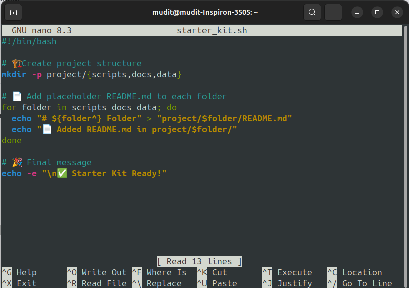
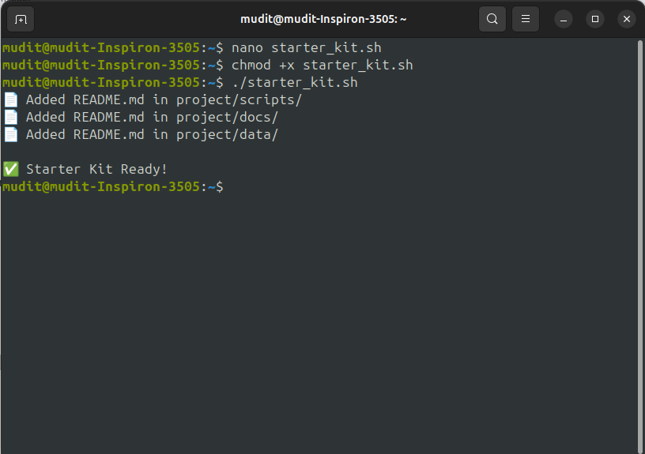

---

# 🧰 Starter Kit Generator – `starter_kit.sh`

> 🎯 Quickly scaffold a basic project structure with documentation placeholders using this simple Bash script.

---

## 🔖 Tech Stack


---

## 📜 Script: `starter_kit.sh`

```bash
#!/bin/bash

# 🏗️ Create project structure
mkdir -p project/{scripts,docs,data}

# 📄 Add placeholder README.md to each folder
for folder in scripts docs data; do
  echo "# ${folder^} Folder" > "project/$folder/README.md"
  echo "📄 Added README.md in project/$folder/"
done

# 🎉 Final message
echo -e "\n✅ Starter Kit Ready!"
```




## 📁 Project Structure Created

```bash
project/
├── scripts/
│   └── README.md
├── docs/
│   └── README.md
└── data/
    └── README.md
```

Each `README.md` contains:

```markdown
# Scripts Folder
```

(or `# Docs Folder`, `# Data Folder` respectively)

---

## 🧪 How to Run the Script

1. **Create the script:**

   ```bash
   nano starter_kit.sh
   ```

2. **Paste the code**, then save and exit (`Ctrl + O`, `Enter`, `Ctrl + X`)

3. **Make it executable:**

   ```bash
   chmod +x starter_kit.sh
   ```

4. **Run it:**

   ```bash
   ./starter_kit.sh
   ```

---

## ✅ Output Example

```
📄 Added README.md in project/scripts/
📄 Added README.md in project/docs/
📄 Added README.md in project/data/

✅ Starter Kit Ready!
```

---

## 💡 Why Use This Script?

| Feature              | Benefit                                    |
| -------------------- | ------------------------------------------ |
| 📁 Auto folder setup | No manual folder creation                  |
| 📄 Placeholder docs  | Prepares folders with default README files |
| 🚀 Fast & repeatable | Perfect for quick project scaffolding      |

---

## 🧠 Customize It Further

* Add `.gitkeep` or `.gitignore` files
* Include license templates
* Scaffold more folders (`src/`, `tests/`, `configs/`)
* Integrate with GitHub Actions setup

---

## 🏁 Final Words

This is a great starter automation script for any project. Keep your structure clean, consistent, and ready-to-go with just **one command**. 🚀

Let me know if you'd like a version that zips the project, initializes a Git repo, or includes license files!
