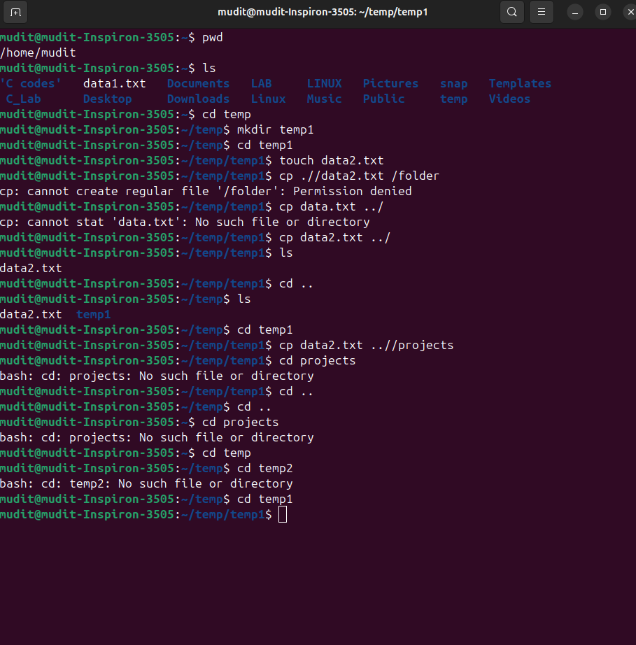

Here's a simple example in Markdown (`.md` file) that demonstrates:

1. Using the `cp` command to copy a file (`data1.txt`) from a **child folder** (`temp2/`) to its **parent folder** (`temp/`).
2. Using the `echo` command to output a confirmation message.

---

## Markdown File Example (`copy_and_echo.md`)

````markdown
# Copy from Child to Parent and Echo Confirmation

This example copies `data1.txt` from the `temp2/` folder into its parent folder `temp/`, and then echoes a confirmation message.

```bash
# Copy the file from temp/temp2 to temp/
cp temp/temp2/data1.txt temp/

# Print a confirmation message
echo "data1.txt has been copied from temp2 to temp"



```   

###  Explanation

- The code block is enclosed in triple backticks, with `bash` specified to enable syntax highlighting suitable for shell commands :contentReference[oaicite:0]{index=0}.
- The first line executes the `cp` command, specifying the path from the child folder (`temp/temp2/data1.txt`) to the parent directory (`temp/`).
- The second line uses `echo` to display a confirmation message once the copy completes—useful in scripts to provide user feedback or logging.
- Specifying `bash` after the opening backticks tells many Markdown renderers (like GitHub’s) to highlight the code appropriately :contentReference[oaicite:1]{index=1}.

---

Feel free to let me know if you'd like to include options like `-v` (verbose) or `-i` (interactive), or embed the commands within a shell script section in the Markdown!
::contentReference[oaicite:2]{index=2}
```

