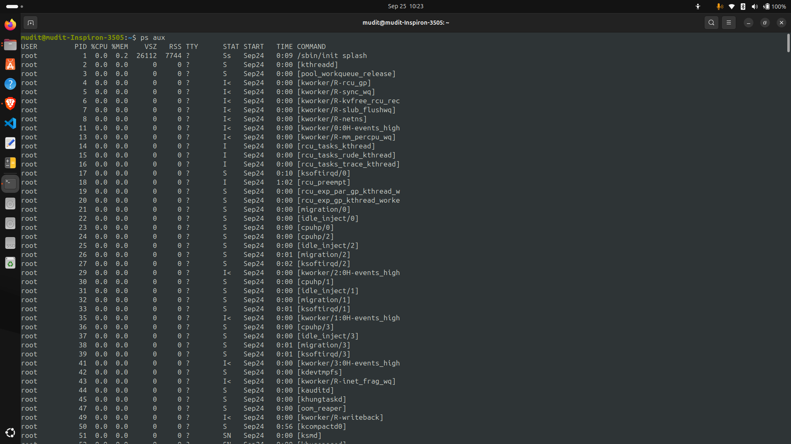
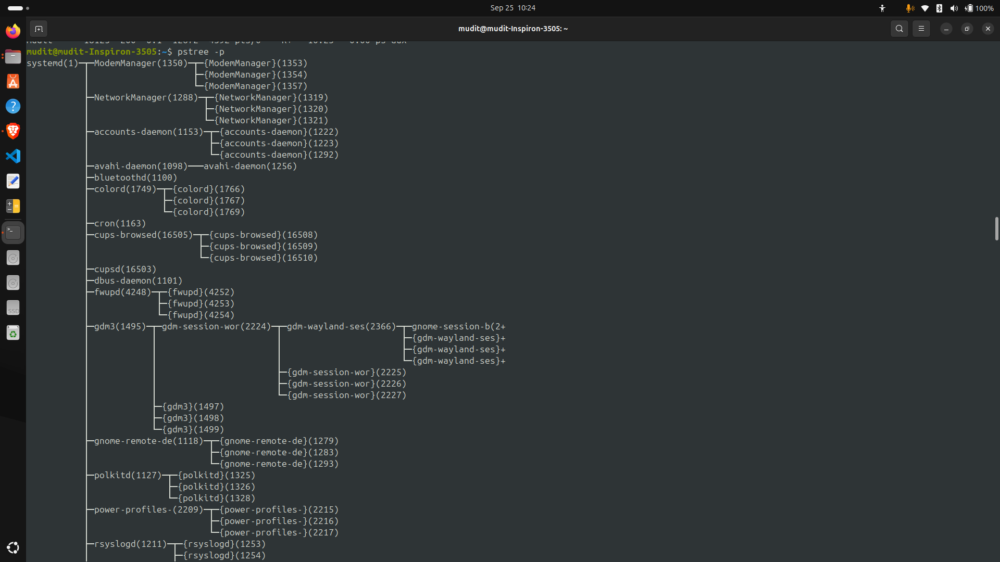
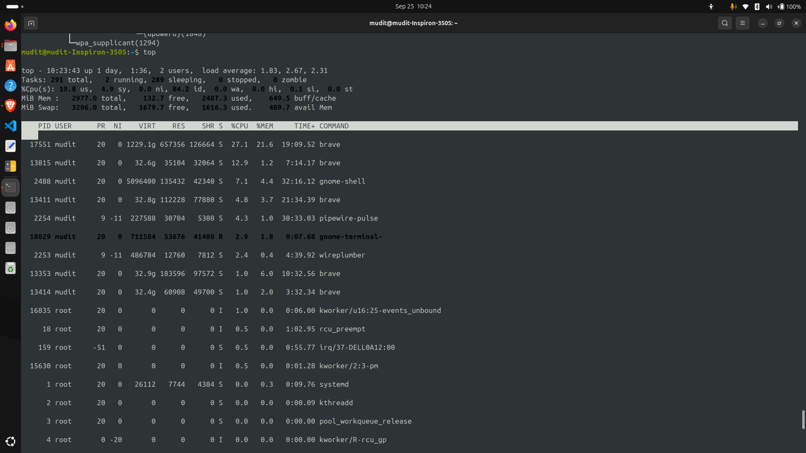
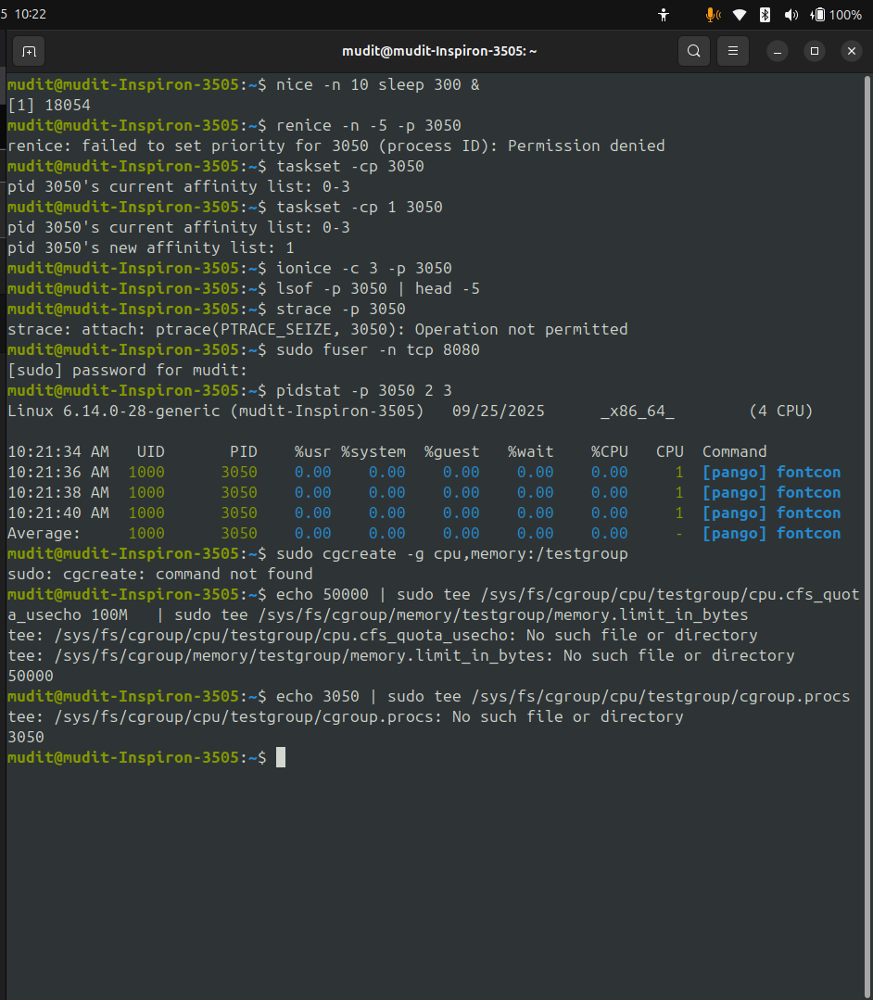

<!-- ================= HEADER WITH BADGES ================= -->
<div align="center">

# 🐚 Shell / Linux Process Management Cheatsheet

[](https://www.linux.org/)  
[](https://www.gnu.org/software/bash/)  
[](#)  

</div>

---

## 📋 Table of Contents

1. [Process Monitoring & Viewing](#1-process-monitoring--viewing)  
2. [Job Control & Background / Foreground](#2-job-control--background--foreground)  
3. [Signals & Termination](#3-signals--termination)  
4. [Priorities & CPU Scheduling](#4-priorities--cpu-scheduling)  
5. [Persistence / Detachment / Logout Safe](#5-persistence--detachment--logout-safe)  
6. [Script Helpers & Cleanup](#6-script-helpers--cleanup)  
7. [Debug & Inspection Tools](#7-debug--inspection-tools)  
8. [Advanced / Miscellaneous Tools](#8-advanced--miscellaneous-tools)  

---

---

## 1. Process Monitoring & Viewing

| 🔎 **Command** | **What It Does** | **Examples / Options** |
|---|---|---|
| `ps` | Snapshot of running processes | `ps aux` / `ps -ef` / `ps -eo pid,user,cmd --sort=-%cpu` |
| `top` | Real‑time process view, CPU & memory usage | `top -d 2` (update every 2s), `top -u username` |
| `htop` | More user‑friendly version of top (if installed) | Use arrow keys, toggle sort etc. |
| `pstree` | Show hierarchical tree of processes | `pstree -p` (shows PIDs) |
| `pgrep pattern` | Find processes matching name / pattern | `pgrep sshd` |
| `pidof name` | Get PID(s) of a process by name | `pidof nginx` |

---

## 2. Job Control & Background / Foreground

| ⚙️ **Action** | **Command** | **When / How to Use** |
|---|---|---|
| Run in background | `command &` | e.g. `./script.sh &` |
| Save its PID | `$!` | `command & pid=$!` — track it |
| List jobs | `jobs` | shows all background or suspended jobs |
| Bring to foreground | `fg %<job_number>` | `fg %1` |
| Resume in background | `bg %<job_number>` | `bg %2` |
| Suspend process | `kill -STOP PID` | pause until resumed |
| Continue after stop | `kill -CONT PID` | resume a stopped process |

---

## 3. Signals & Termination

| 🛑 **Command** | **Purpose** | **Notes** |
|---|---|---|
| `kill PID` | Send default signal (`SIGTERM`) for graceful shutdown | |
| `kill -9 PID` | Send `SIGKILL` (force kill) — cannot be caught | Use only if graceful fails |
| `kill -l` | List all signal names / numbers | `kill -l` |
| `pkill pattern` | Kill / signal processes by name / pattern | `pkill httpd` |
| `killall name` | Kill all processes with this name | `killall firefox` |
| `trap '…' SIGINT SIGTERM EXIT` | In scripts: catch signals to clean up | Useful for cleanup or safe exits |

---

## 4. Priorities & CPU Scheduling

| ⚡ **Feature** | **Command** | **Use Case / Example** |
|---|---|---|
| Start with lower priority | `nice -n <value> command` | `nice -n 10 ./longtask.sh` |
| Change priority of running process | `renice -n <value> <PID>` | `renice -n -5 1234` |
| Set CPU cores (affinity) | `taskset -c <cores> command` | `taskset -c 0,2 myapp` |

---

## 5. Persistence / Detachment / Logout Safe

| 🔒 **Command / Technique** | **Goal** | **Example** |
|---|---|---|
| `nohup command &` | Keep process alive after logging out | `nohup mydaemon.sh > out.log 2>&1 &` |
| `disown` | Remove job from shell job table | After `&`, run `disown %1` |
| `setsid` | Start as a new session, detached from terminal | `setsid my_process &` |

---

## 6. Script Helpers & Cleanup

```bash
#!/usr/bin/env bash

cleanup() {
  echo "🧹 Cleaning up..."
  if [[ -n $child_pid ]]; then
    kill $child_pid 2>/dev/null
  fi
}
trap cleanup EXIT INT TERM

# Start a background job
long_running_task &
child_pid=$!
echo "Started task with PID $child_pid"

# Do something else
# ...

# Wait for it
wait $child_pid
echo "Task completed!"
```



