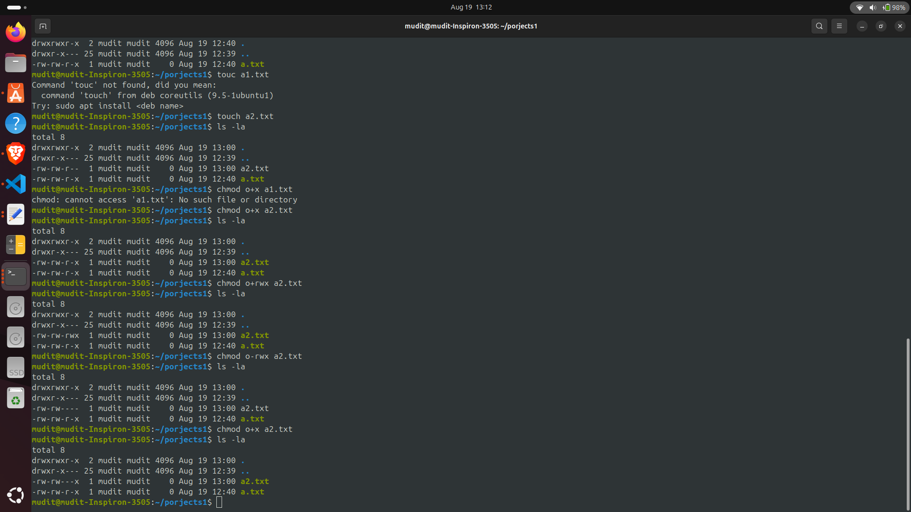

```markdown
# 🐚 Shell Tutorial – File Permissions with `chmod` and `chown`

---

## 🌟 Introduction
In Linux, **file permissions** are a key part of system security. They define **who** can read, write, or execute a file or directory. Two important commands for managing permissions are:
- **`chmod`** → Change file permissions
- **`chown`** → Change file ownership

This tutorial will help you master these commands with clear explanations, diagrams, and examples. 🚀

---

## 🔹 1. Understanding File Permissions
Each file/directory has three categories of users:
- 👤 **Owner (User)** → The file creator
- 👥 **Group** → Users in the same group
- 🌍 **Others** → Everyone else

### Permission Types
- **r (read)** → View file contents/list directory
- **w (write)** → Modify contents/add or remove files
- **x (execute)** → Run program/enter directory

### Visual Diagram 🖼️
```

```
       [ File / Directory ]
             / | \
            /  |  \
           /   |   \
       Owner  Group  Others
         |      |      |
    (r,w,x) (r,w,x) (r,w,x)
```

````
Each category (Owner, Group, Others) can have different permissions.

### Example from `ls -l`
```bash
-rwxr-xr-- 1 mudit dev 1024 Aug 19 file.sh
````

Breakdown:

* `-` → Regular file (`d` = directory, `l` = link)
* `rwx` → Owner has full rights
* `r-x` → Group has read + execute
* `r--` → Others can only read

---

## 🔹 2. `chmod` – Change File Permissions

### ⚙️ Syntax

```bash
chmod [options] mode filename
```

Modes can be **numeric (octal)** or **symbolic**.

### (A) Numeric (Octal) Method

Each permission is a number:

* **4** = Read
* **2** = Write
* **1** = Execute

Add them up for each category:

* `7 = rwx`
* `6 = rw-`
* `5 = r-x`
* `4 = r--`

✅ Example:

```bash
chmod 755 file.sh
```

Means → Owner: `rwx`, Group: `r-x`, Others: `r-x`

📊 Visualization:

```
7 5 5
rwx r-x r-x
```

---

### (B) Symbolic Method

Use:

* `u` (user), `g` (group), `o` (others), `a` (all)
* `+` add, `-` remove, `=` set exact

✅ Examples:

```bash
chmod u+x file.sh     # Add execute to owner
chmod g-w notes.txt   # Remove write for group
chmod o=r file.txt    # Others can only read
chmod a+r report.txt  # Everyone can read
```

---

### (C) Recursive Changes

Apply to all files/subfolders:

```bash
chmod -R 755 mydir/
```

---

## 🔹 3. `chown` – Change File Ownership

### ⚙️ Syntax

```bash
chown [options] new_owner:new_group filename
```

✅ Examples:

```bash
chown mudit file.txt           # Change owner to mudit
chown mudit:dev file.txt       # Owner = mudit, Group = dev
chown :dev file.txt            # Change only group
chown -R mudit:dev /project    # Apply recursively
```

---

## 🔹 4. Example Scenario

```bash
touch project.sh
ls -l project.sh
```

Output:

```
-rw-r--r-- 1 mudit dev 0 Aug 19 12:00 project.sh
```

Now:

```bash
chmod 700 project.sh       # Only owner has rwx
chmod u+x,g-w project.sh   # Add execute for owner, remove write from group
chown root:admin project.sh # Change owner to root, group to admin
```

✅ Final permissions:

```
-rwxr----- 1 root admin 0 Aug 19 12:00 project.sh
```

---

## 🔹 5. Quick Reference Table 📑

| Numeric | Permission | Meaning         |
| ------- | ---------- | --------------- |
| 0       | ---        | No access       |
| 1       | --x        | Execute only    |
| 2       | -w-        | Write only      |
| 3       | -wx        | Write + Execute |
| 4       | r--        | Read only       |
| 5       | r-x        | Read + Execute  |
| 6       | rw-        | Read + Write    |
| 7       | rwx        | Full access     |

---

## 🌟 Conclusion

* Use **`chmod`** to set permissions (`rwx` → numeric or symbolic).
* Use **`chown`** to change file ownership.
* Always apply the principle of least privilege for security. 🔐

✨ You are now ready to manage Linux file permissions like a pro!

```
```
