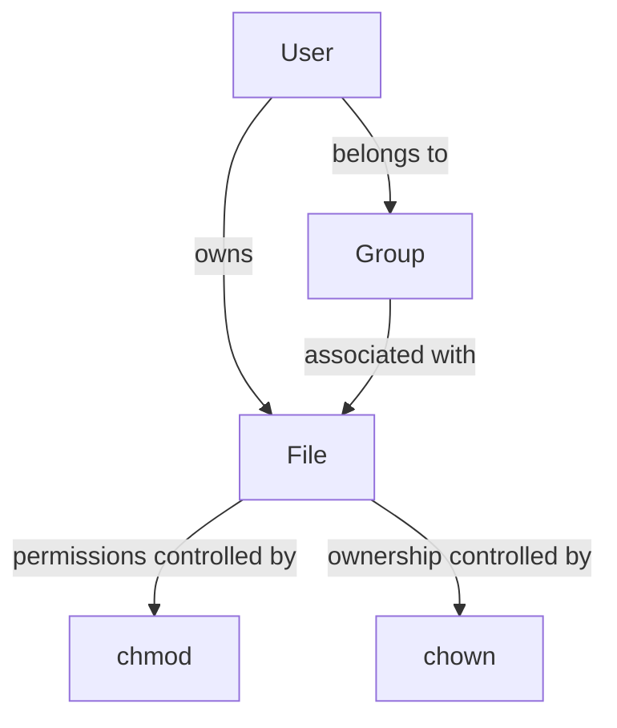

# 🐚 Shell Tutorial – Mastering File Permissions with `chmod` and `chown`

Linux is built on a **multi-user** system, and managing **file permissions** is a critical skill.  
This tutorial will help you **understand and master** file permissions with two powerful commands:  
- **`chmod`** → Change file **permissions** (read, write, execute).  
- **`chown`** → Change file **ownership** (user and group).  

---

## 🔖 Badges  
  
  
  

---

## 📌 Understanding File Permissions

Check file details with:  
```bash

````

Example output:

```-rwxr-xr-- 1 user group 1234 Aug 22 10:00 script.sh
```

---

## 🎯 Visual Breakdown of Permissions

```
┌─────────┬──────────┬─────────┐
│  User   │  Group   │ Others  │
├─────────┼──────────┼─────────┤
│   rwx   │   r-x    │   r--   │
└─────────┴──────────┴─────────┘
```

* **User (Owner):** Has full access → `rwx`
* **Group:** Can read & execute → `r-x`
* **Others:** Can only read → `r--`

👉 This matches the permission string: `-rwxr-xr--`

---

## 🔧 Using `chmod` (Change Permissions)

### 1️⃣ Symbolic Method

```bash
chmod u+x script.sh
```

* Adds execute permission for the **user**.

```bash
chmod g-w script.sh
```

* Removes write permission from the **group**.

```bash
chmod o=r script.sh
```

* Sets others’ permissions to **read only**.

---

### 2️⃣ Numeric Method

Permissions can be represented in **octal numbers**:

| Number | Permission | Binary | Meaning                |
| ------ | ---------- | ------ | ---------------------- |
| `7`    | rwx        | 111    | Read + Write + Execute |
| `6`    | rw-        | 110    | Read + Write           |
| `5`    | r-x        | 101    | Read + Execute         |
| `4`    | r--        | 100    | Read only              |
| `0`    | ---        | 000    | No access              |

Example:

```bash
chmod 754 script.sh
```

* User → `7 (rwx)`
* Group → `5 (r-x)`
* Others → `4 (r--)`

---

## 👑 Using `chown` (Change Ownership)

Change file owner:

```bash
sudo chown newuser script.sh
```

Change file owner and group:

```bash
sudo chown newuser:newgroup script.sh
```

---

## 📊 Ownership Flow (Mermaid Diagram)


```mermaid
flowchart TD
    A[User] -->|owns| C[File]
    B[Group] -->|associated with| C[File]
    A -->|belongs to| B
    C -->|permissions controlled by| D[chmod]
    C -->|ownership controlled by| E[chown]
```

---

## 📊 Command Summary

| Command                 | Description                        |
| ----------------------- | ---------------------------------- |
| `ls -l`                 | View file permissions & ownership  |
| `chmod u+x file`        | Add execute permission for user    |
| `chmod g-w file`        | Remove write permission for group  |
| `chmod 754 file`        | Set permissions using octal values |
| `chown user file`       | Change file owner                  |
| `chown user:group file` | Change file owner and group        |

---

## 📸 Example Screenshot

(Add your screenshot in an `images/` folder and reference like below 👇)

```markdown
`

```

---

## ✅ Key Takeaways

* **`chmod`** → Controls **permissions** (who can read/write/execute).
* **`chown`** → Controls **ownership** (who owns the file/group).
* Always verify changes with:

  ```bash
  ls -l
  ```

---

💡 **Pro Tip:** Restrict permissions as much as possible for security. Example → scripts should only be **executable by the owner**.

```

---

⚡ N
