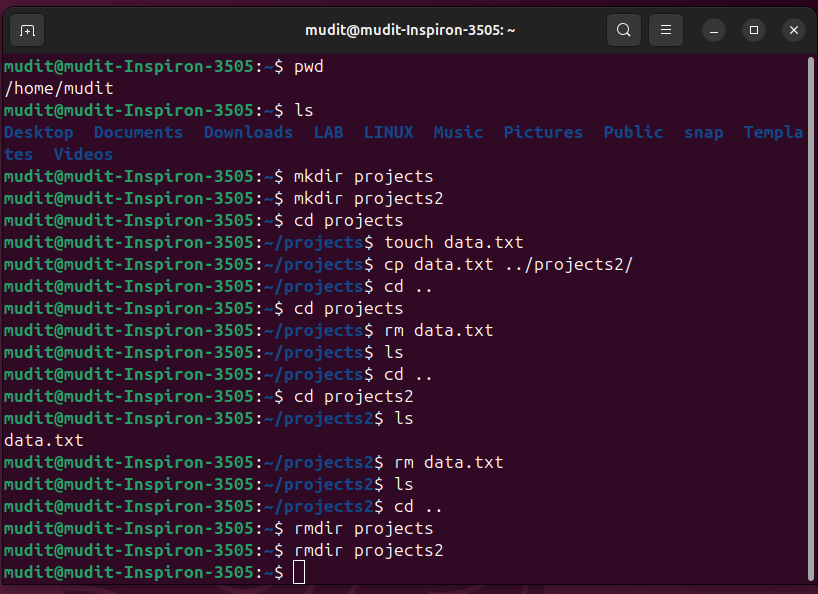

Here’s a complete `commands.md` file containing explanations and examples of the following Linux commands:

* `cp` – copy files or directories
* `mmv` – mass rename/move files (from the `mmv` utility)
* `touch` – create new empty files
* `mv` – move or rename files
* `rm` – remove files
* `rm -rf` – forcefully remove files/directories recursively

---

### 📄 `commands.md`

````markdown
# Linux Command Reference: `cp`, `mmv`, `touch`, `mv`, `rm`, and `rm -rf`

This document provides a brief overview of commonly used Linux file manipulation commands with examples.

---

## 📁 1. `cp` – Copy Files or Directories

**Syntax:**
```bash
cp [options] source destination
````

**Example:**

```bash
cp file.txt /home/user/Documents/
```

➡️ Copies `file.txt` to the `Documents` folder.

---

## 🔄 2. `mmv` – Move or Rename Multiple Files

> `mmv` is not installed by default on all systems. You can install it using:
>
> ```bash
> sudo apt install mmv  # Debian/Ubuntu
> ```

**Syntax:**

```bash
mmv [options] source_pattern target_pattern
```

**Example:**

```bash
mmv '*.txt' 'text_#1.txt'
```

➡️ Renames all `.txt` files to `text_filename.txt`.

---

## 📄 3. `touch` – Create Empty Files

**Syntax:**

```bash
touch filename
```

**Example:**

```bash
touch newfile.txt
```

➡️ Creates an empty file named `newfile.txt`.

---

## 🔀 4. `mv` – Move or Rename Files and Directories

**Syntax:**

```bash
mv [options] source destination
```

**Simple Example: Move File to Another Folder**

```bash
mv file.txt /home/user/Documents/
```

➡️ Moves `file.txt` to the `Documents` folder.

**Rename File Example:**

```bash
mv oldname.txt newname.txt
```

➡️ Renames the file from `oldname.txt` to `newname.txt`.

---

## 🗑️ 5. `rm` – Remove Files

**Syntax:**

```bash
rm filename
```

**Example:**

```bash
rm unwanted.txt
```

➡️ Deletes `unwanted.txt`.

---

## ☠️ 6. `rm -rf` – Forcefully Remove Directories Recursively

**Syntax:**

```bash
rm -rf directory_name
```

**Example:**

```bash
rm -rf /home/user/OldProjects/
```

➡️ Forcefully deletes the `OldProjects` directory and all its contents.

> ⚠️ **Use with caution!** This command is irreversible.



---

## ✅ Summary Table

| Command  | Description                         | Example                    |
| -------- | ----------------------------------- | -------------------------- |
| `cp`     | Copy files or folders               | `cp file.txt /folder/`     |
| `mmv`    | Bulk move/rename files              | `mmv '*.log' 'old_#1.log'` |
| `touch`  | Create empty files                  | `touch myfile.txt`         |
| `mv`     | Move or rename files                | `mv file.txt /new/folder/` |
| `rm`     | Remove files                        | `rm file.txt`              |
| `rm -rf` | Forcefully delete files/directories | `rm -rf /my/folder/`       |

---

```

