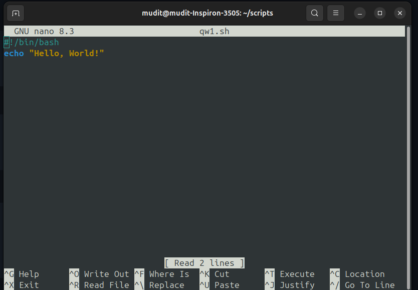
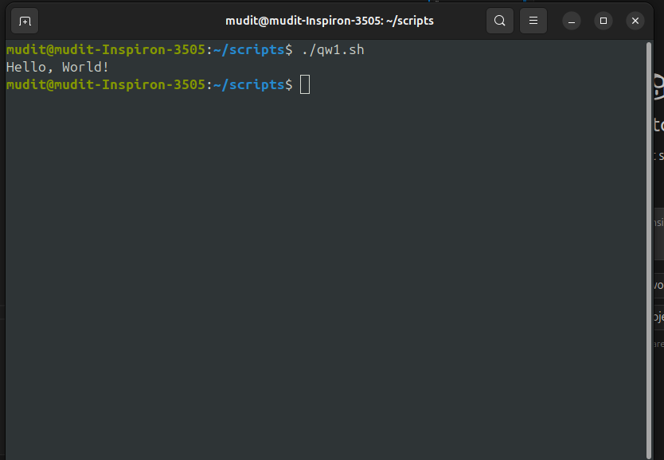
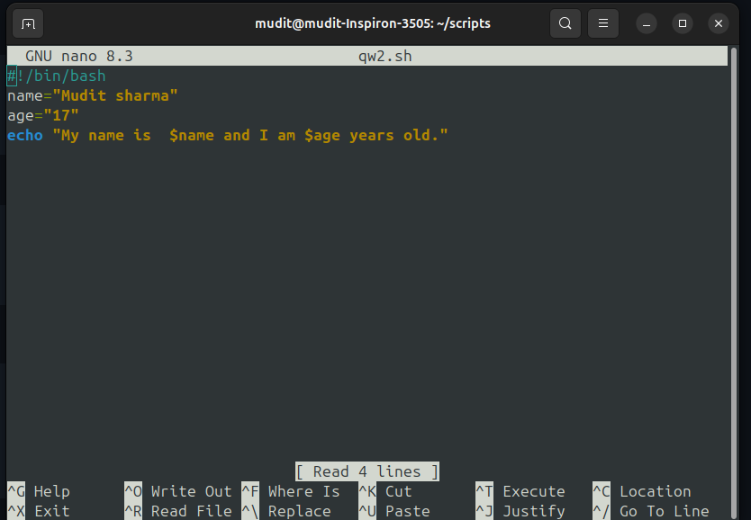
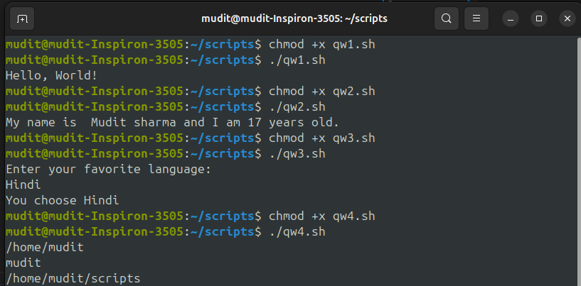

# 🐚 Shell Scripting Tutorial 🚀

 
 
 


Shell scripting allows you to **automate tasks** in Linux/Unix by writing commands inside a file that the shell executes line by line.  

---

## 1️⃣ What is a Shell Script?

- A **shell** = command-line interpreter (e.g., `bash`, `zsh`, `sh`)  
- A **shell script** = a text file with a series of commands  
- File usually has **`.sh`** extension (not mandatory)  

📄 **Example (`hello.sh`)**  
```bash
#!/bin/bash
echo "Hello, World!"


````


▶️ **Run it**

```bash
chmod +x hello.sh   # make it executable
./hello.sh
```

✅ Output:

```
Hello, World!
```

---

## 2️⃣ Variables

Variables store data (text, numbers, paths, etc.).

⚡ **Define variables**

```bash
name="Mudit"
age=18
```

⚠️ No spaces around `=`.

🔎 **Access variables**

```bash
echo "My name is $name and I am $age years old."
```

Output:

```
My name is Mudit and I am 18 years old.
```




🌍 **Environment Variables**

```bash
echo $HOME   # home directory
echo $USER   # current user
echo $PWD    # present working directory
```

---

## 3️⃣ User Input

```bash
#!/bin/bash
echo "Enter your favorite language:"
read lang
echo "You chose $lang"
```

---

## 4️⃣ Conditional Statements (if-else)

```bash
#!/bin/bash
num=10

if [ $num -gt 5 ]; then
    echo "Number is greater than 5"
else
    echo "Number is less than or equal to 5"
fi
```

🧮 Operators:

* `-eq` = equal
* `-ne` = not equal
* `-gt` = greater than
* `-lt` = less than
* `-ge` = greater or equal
* `-le` = less or equal

---

## 5️⃣ Loops

🔁 **For Loop**

```bash
for i in {1..5}
do
    echo "Iteration $i"
done
```

🔁 **While Loop**

```bash
count=1
while [ $count -le 5 ]
do
    echo "Count: $count"
    ((count++))
done
```

🔁 **Until Loop**

```bash
x=1
until [ $x -gt 5 ]
do
    echo "Value: $x"
    ((x++))
done
```

---

## 6️⃣ Functions

```bash
greet() {
    echo "Hello, $1"
}

greet Mudit
greet World
```

Output:

```
Hello, Mudit
Hello, World
```

---

## 7️⃣ Command Line Arguments

```bash
#!/bin/bash
echo "Script name: $0"
echo "First argument: $1"
echo "Second argument: $2"
echo "All arguments: $@"
echo "Number of arguments: $#"
```

▶️ Run:

```bash
./script.sh apple banana
```

✅ Output:

```
Script name: ./script.sh
First argument: apple
Second argument: banana
All arguments: apple banana
Number of arguments: 2
```

---

## 8️⃣ Arrays

```bash
fruits=("apple" "banana" "cherry")

echo "First fruit: ${fruits[0]}"

for fruit in "${fruits[@]}"; do
    echo "Fruit: $fruit"
done
```

---

## 9️⃣ Useful Commands in Scripts

* 🗓️ `date` → show current date/time
* 👤 `whoami` → show current user
* 📂 `ls` → list files
* 📍 `pwd` → print working directory
* 📖 `cat` → read file contents

---

## 🔟 A Practical Example – Backup Script

📦 **`backup.sh`**

```bash
#!/bin/bash
# Backup home directory to /tmp

backup_file="/tmp/home_backup_$(date +%Y%m%d%H%M%S).tar.gz"

tar -czf $backup_file $HOME

echo "Backup saved to $backup_file"
```

▶️ Run:

```bash
./backup.sh
```

---

## 📚 Summary

| 🔑 Concept   | 📜 Example         |
| ------------ | ------------------ |
| Script       | `./hello.sh`       |
| Variables    | `name="Mudit"`     |
| Input        | `read var`         |
| Conditionals | `if [ $a -gt 5 ]`  |
| Loops        | `for i in {1..5}`  |
| Functions    | `greet() { ... }`  |
| Args         | `$0 $1 $2 $@ $#`   |
| Arrays       | `fruits=("a" "b")` |
| Backup       | `tar -czf`         |

---

💡 **Pro Tip:** Shell scripting = 💪 Power + ⚡ Automation + 🚀 Productivity.
Keep practicing by writing **small utility scripts** to master it!

```

---

```


